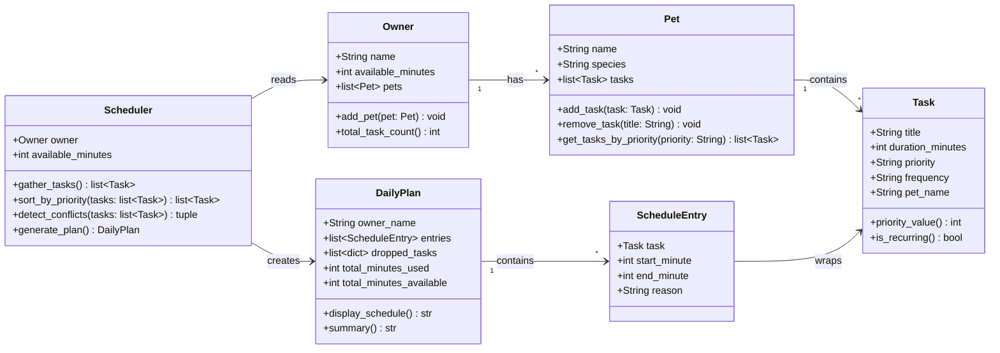

# PawPal+ Class Diagram

```mermaid
classDiagram
    direction LR

    class Owner {
        +String name
        +int available_minutes
        +list~Pet~ pets
        +add_pet(pet: Pet) void
        +total_task_count() int
    }

    class Pet {
        +String name
        +String species
        +list~Task~ tasks
        +add_task(task: Task) void
        +remove_task(title: String) void
        +get_tasks_by_priority(priority: String) list~Task~
    }

    class Task {
        +String title
        +int duration_minutes
        +String priority
        +String frequency
        +String pet_name
        +priority_value() int
        +is_recurring() bool
    }

    class Scheduler {
        +Owner owner
        +int available_minutes
        +gather_tasks() list~Task~
        +sort_by_priority(tasks: list~Task~) list~Task~
        +detect_conflicts(tasks: list~Task~) tuple
        +generate_plan() DailyPlan
    }

    class DailyPlan {
        +String owner_name
        +list~ScheduleEntry~ entries
        +list~dict~ dropped_tasks
        +int total_minutes_used
        +int total_minutes_available
        +display_schedule() str
        +summary() str
    }

    class ScheduleEntry {
        +Task task
        +int start_minute
        +int end_minute
        +String reason
    }

    Owner "1" --> "*" Pet : has
    Pet "1" --> "*" Task : contains
    Scheduler --> Owner : reads
    Scheduler --> DailyPlan : creates
    DailyPlan "1" --> "*" ScheduleEntry : contains
    ScheduleEntry --> Task : wraps
```
